# Manuscript Draft

## Part 1: Study Design 

### Overview of Drug Repurposing Analysis

We evaluated two transcriptomic drug repurposing platforms—CMAP (microarray-based) and TAHOE (single-cell RNA sequencing-based)—by validating their predictions against established drug-disease relationships from Open Targets. Starting with 233 disease signatures from CREEDS, we matched 203 diseases (87%) to Open Targets annotations, of which 180 had known therapeutic drugs. This systematic comparison provides critical insights into the complementary strengths of microarray-based perturbation signatures versus single-cell RNA sequencing approaches for computational drug repurposing.

### Dataset Composition

Both platforms analyzed overlapping disease sets mapped to 20 therapeutic areas, with Cancer/Tumor representing the largest category (27 diseases, 15.0%), followed by Genetic/Congenital disorders (20 diseases, 11.1%), Nervous System conditions (18 diseases, 10.0%), and Immune System diseases (13 diseases, 7.2%). The remaining categories included Gastrointestinal (11), Musculoskeletal (11), Cardiovascular (9), Infectious Disease (9), Respiratory (8), Hematologic (7), Psychiatric (7), Reproductive/Breast (7), Endocrine System (6), Phenotype (6), Urinary System (5), Skin/Integumentary (5), Metabolic (5), Pancreas (3), Visual System (2), and Pregnancy/Perinatal (1) diseases. This broad therapeutic coverage enables robust assessment of platform performance across diverse disease mechanisms (Figure 1C).

The two platforms utilize distinct chemical libraries with limited overlap. CMAP encompasses 457 unique drugs matched to Open Targets, while TAHOE contains 170 drugs matched to the same validation resource. Notably, only 43 drugs (9.4% of CMAP, 25.3% of TAHOE) were shared between platforms, reflecting fundamental differences in library composition. CMAP includes Broad Institute proprietary compounds and research chemicals optimized for perturbation signature generation, while TAHOE focuses on clinically-characterized therapeutics with established mechanisms of action.

The drug target class distributions reveal distinct mechanistic profiles between platforms. CMAP displays a receptor-oriented profile, with membrane receptors comprising the largest category (166 drugs, 33.6%), followed by enzymes (116 drugs, 23.5%), ion channels (66 drugs, 13.4%), transcription factors (61 drugs, 12.4%), and transporters (49 drugs, 9.9%) (Figure 1A). In contrast, TAHOE demonstrates an enzyme-centric profile, with enzyme inhibitors representing the dominant category (104 drugs, 48.4%), followed by transcription factors (24 drugs, 11.2%), unclassified proteins (24 drugs, 11.2%), membrane receptors (23 drugs, 10.7%), and other cytosolic proteins (12 drugs, 5.6%) (Figure 1B). These compositional differences have important implications for platform selection based on target class of interest.

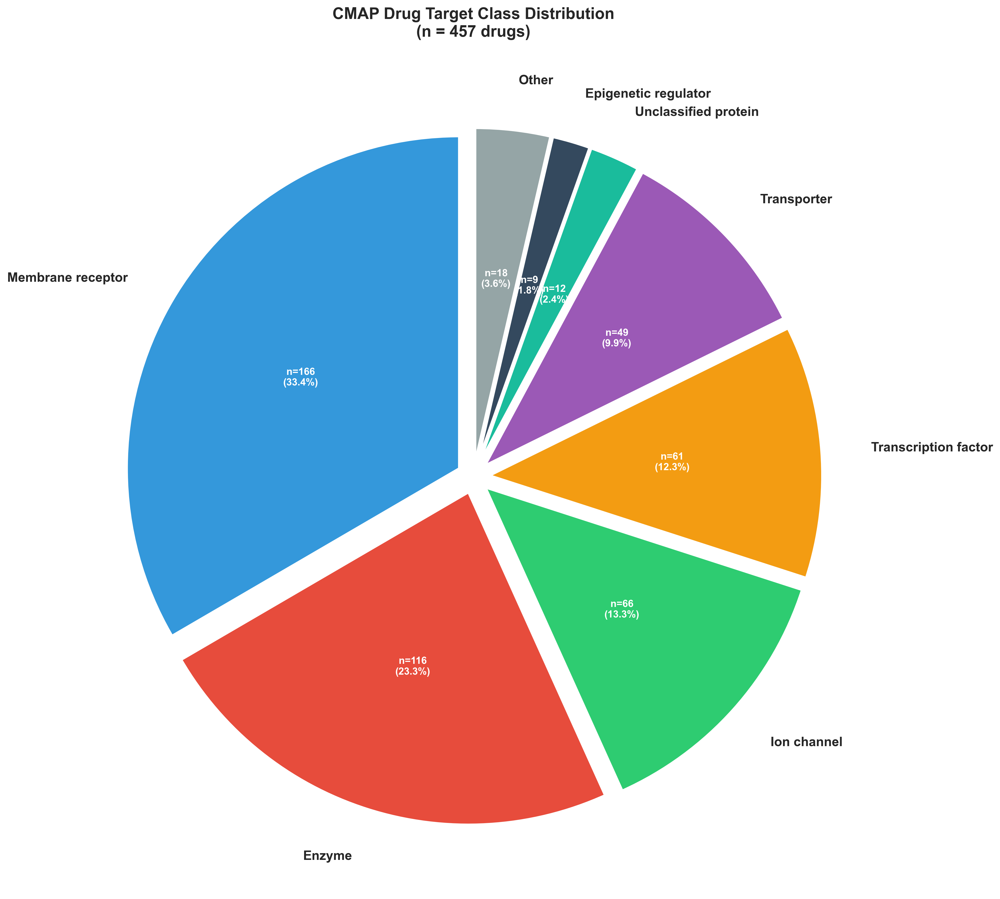

*Figure 1A. Distribution of drug target classes in CMAP. Pie chart showing the proportion of drugs by target class among the 457 CMAP drugs matched to Open Targets, revealing a receptor-oriented profile with membrane receptors (33.6%) and enzymes (23.5%) as the dominant categories.*

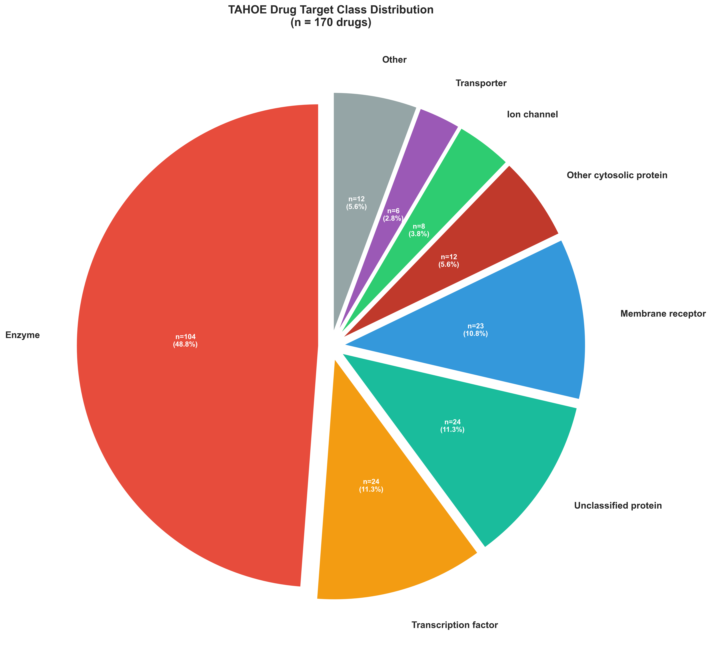

*Figure 1B. Distribution of drug target classes in TAHOE. Pie chart showing the proportion of drugs by target class among the 170 TAHOE drugs matched to Open Targets, demonstrating a strongly enzyme-centric profile (48.4%) with reduced representation of membrane receptors compared to CMAP.*

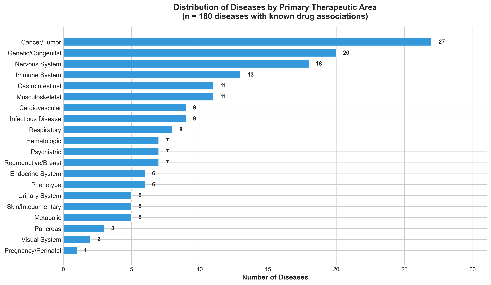

*Figure 1C. Distribution of diseases by primary therapeutic area. Horizontal bar chart showing the number of diseases in each of the 20 therapeutic area categories analyzed, with Cancer/Tumor (27 diseases) and Genetic/Congenital (20 diseases) representing the largest categories among the 180 diseases with known drug associations.*

### Supplementary Materials

Table S1 provides the complete list of TAHOE drugs with drug IDs, common names, and target classes (see [open_target_drugs_in_tahoe.csv](../about_drugs/open_target_drugs_in_tahoe.csv)). Table S2 provides the corresponding complete list of CMAP drugs (see [open_target_drugs_in_cmap.csv](../about_drugs/open_target_drugs_in_cmap.csv)). Table S3 contains the complete list of 180 diseases with disease IDs and therapeutic area classifications (see [creeds_diseases_with_known_drugs.csv](../about_diseases/creeds_diseases_with_known_drugs.csv)).

## Part 2: Prediction Recovery and Validation

We validated predictions by calculating precision (proportion of predictions confirmed in Open Targets) and recall (proportion of recoverable known relationships successfully predicted) for each disease category.

### Disease Grouping for Precision/Recall Analysis

Each disease in our analysis was assigned to therapeutic area combination(s) based on Open Targets classification. These combinations can include multiple base therapeutic areas (e.g., "Cancer/Tumor|Gastrointestinal" for colorectal cancers). Since diseases sharing identical therapeutic area combinations have overlapping drug-disease relationship annotations in Open Targets, we grouped predictions by these combinations for precision/recall calculations.

From 21 base therapeutic areas, CMAP diseases mapped to 101 unique combinations, while TAHOE diseases mapped to 112 unique combinations. Most combinations (74% for CMAP) contained only a single disease, while the remainder grouped 2-6 diseases with identical therapeutic classifications. For reporting clarity, each combination is represented by a single exemplar disease name in the results tables.

### Summary Statistics

| Metric | CMAP | TAHOE | Advantage |
|--------|------|-------|-----------|
| Unique Diseases | 155 | 171 | TAHOE +10% |
| Total Predictions | 5,241 | 9,946 | TAHOE +90% |
| Recovered Predictions | 948 | 2,198 | **TAHOE 2.3×** |
| Recovery Rate | 18.1% | 22.1% | TAHOE +4% |

TAHOE substantially outperformed CMAP, recovering 2,198 validated drug-disease pairs compared to 948 for CMAP—a 2.3-fold advantage that extends across multiple performance dimensions. TAHOE covered more diseases (171 vs. 155) while achieving a higher overall recovery rate (22.1% vs. 18.1%).

### Precision and Recall Analysis

We validated predictions for each individual disease (155 CMAP, 171 TAHOE) by calculating precision and recall against Open Targets known drug-disease relationships. For each disease, we defined three metrics: I (unique drugs predicted for that disease), S (predicted drugs validated in Open Targets for that specific disease), and P (known drugs from Open Targets that exist in the platform's drug library, representing the maximum recoverable ceiling). Precision was calculated as S/I × 100 (proportion of predictions that were validated), and recall as S/P × 100 (proportion of recoverable known drugs successfully predicted).

To illustrate this methodology, consider lung adenocarcinoma in TAHOE: the pipeline predicted 61 unique drugs (I = 61), of which 10 were validated in Open Targets (S = 10), yielding a precision of 16.4%. Open Targets documents 48 known drugs for this disease, but only 12 of these exist in TAHOE's 221-drug library, setting the recoverable ceiling at P = 12. The pipeline successfully predicted 10 of these 12 recoverable drugs, achieving 83.3% recall. This calculation was performed identically for all 326 diseases across both platforms (Table S3 for CMAP, Table S4 for TAHOE).

Across all diseases, TAHOE demonstrated superior performance on both metrics. Mean precision was 4.2% (SD 7.2%) for TAHOE compared to 3.2% (SD 5.5%) for CMAP. The recall advantage was more pronounced: among diseases with at least one recoverable drug (P > 0), TAHOE achieved mean recall of 20.3% (SD 20.5%) versus 8.9% (SD 12.0%) for CMAP. TAHOE also identified at least one validated drug (S > 0) for 95 of 171 diseases (55.6%) compared to 74 of 155 diseases (47.7%) for CMAP.

The TAHOE advantage was consistent when examining performance thresholds. For precision, 21 of 171 (12.3%) TAHOE diseases exceeded 10% precision compared to 13 of 155 (8.4%) for CMAP, and 7 TAHOE diseases (4.1%) achieved greater than 20% precision versus only 3 CMAP diseases (1.9%). The recall differences were even more striking: 91 of 146 (62.3%) TAHOE diseases with recoverable drugs exceeded 10% recall compared to 46 of 140 (32.9%) for CMAP, while 68 TAHOE diseases (46.6%) surpassed 20% recall versus only 22 CMAP diseases (15.7%). Notably, 6 TAHOE diseases achieved greater than 50% recall (4.1%), including the lung adenocarcinoma example above, whereas no CMAP disease exceeded this threshold.

#### Part 2 Visualization

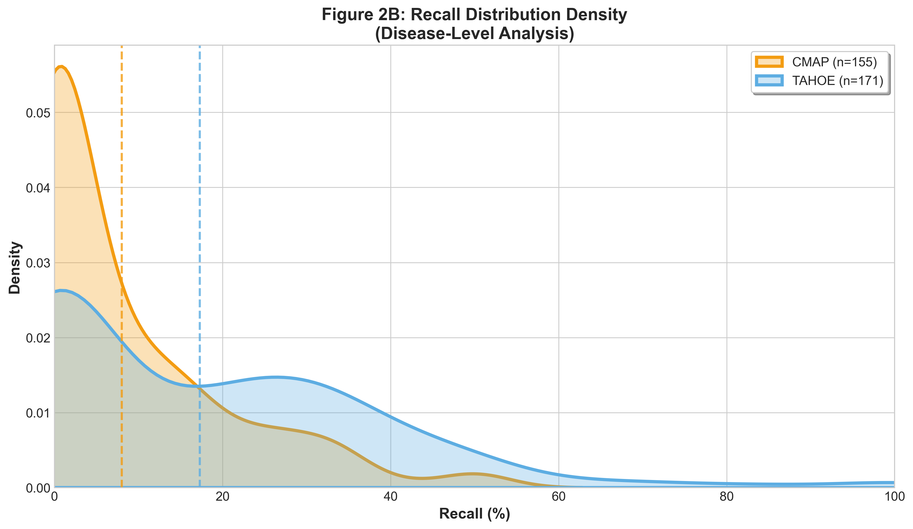

*Figure 2A. Recall distribution density by platform. Kernel density estimation showing the probability density of recall values across diseases for CMAP (orange, n=155 diseases) and TAHOE (blue, n=171 diseases). Dashed vertical lines indicate platform means: CMAP 8.0% and TAHOE 17.3%. TAHOE demonstrates significantly higher recall (Mann-Whitney U test p=1.86×10⁻⁴), with a broader distribution extending to 100% recall for top-performing diseases.*

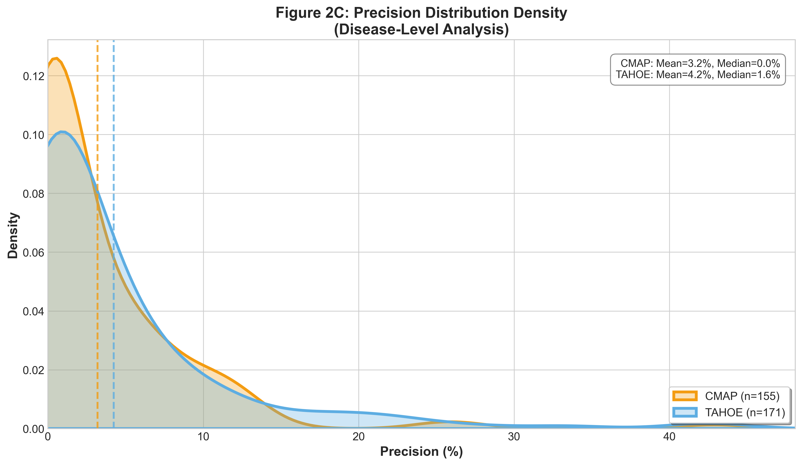

*Figure 2B. Precision distribution density by platform. Kernel density estimation showing the probability density of precision values for CMAP (orange, n=155 diseases) and TAHOE (blue, n=171 diseases). Mean precision was 3.2% for CMAP and 4.2% for TAHOE. Both platforms show right-skewed distributions with most diseases achieving low precision, reflecting the challenge of predicting validated drug-disease relationships from transcriptomic signatures alone.*

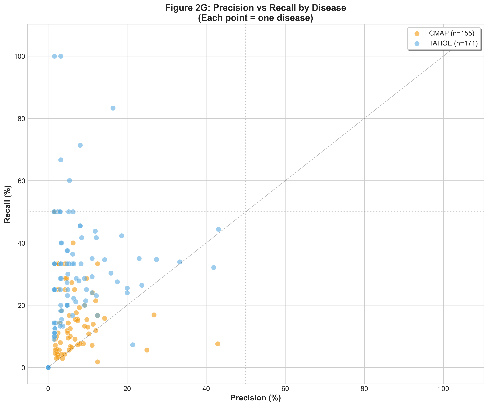

*Figure 2C. Precision versus recall scatter plot by disease. Each point represents a single disease, with CMAP (orange, n=155) and TAHOE (blue, n=171) shown separately. Reference lines at 50% precision and 50% recall highlight the upper performance quadrant. TAHOE diseases cluster at higher recall values while maintaining comparable precision, demonstrating superior overall performance for recovering known drug-disease relationships.*

**Supplementary Tables:**
- **Table S3:** CMAP per-disease precision and recall metrics (see [cmap_precision_recall_per_disease.csv](../about_drpipe_results/recall_precision/intermediate_data/cmap_precision_recall_per_disease.csv))
- **Table S4:** TAHOE per-disease precision and recall metrics (see [tahoe_precision_recall_per_disease.csv](../about_drpipe_results/recall_precision/intermediate_data/tahoe_precision_recall_per_disease.csv)) 

## Part 3: CMAP vs TAHOE Recovery Analysis: Platform Selection Guidelines

### Platform Concordance: Complementary Rather Than Redundant

A striking finding is the remarkably low concordance between CMAP and TAHOE predictions. Among validated drug-disease pairs, only 144 (4.8% Jaccard index) were identified by both platforms. This divergence extends to all predictions, where only 173 pairs (1.2% Jaccard index) overlapped between the 5,241 CMAP and 9,946 TAHOE predictions.

This near-orthogonal output pattern demonstrates that the two platforms capture fundamentally different aspects of drug-disease relationships rather than redundantly sampling the same therapeutic space. The low concordance should not be interpreted as methodological failure but rather as evidence that transcriptomic drug repurposing can be approached from multiple complementary angles—one leveraging drug-induced perturbation signatures (CMAP) and the other leveraging disease-associated expression patterns (TAHOE).

### Platform-Specific Strengths and Optimal Use Cases

Our analysis reveals distinct mechanistic profiles that inform platform selection. TAHOE displays a strongly enzyme-centric profile, with enzyme inhibitors—particularly kinases relevant to oncology—comprising 44-46% of all discoveries and recovered predictions. This enrichment reflects TAHOE's sensitivity to dysregulated signaling pathway signatures, as kinase cascades represent nodal points in cellular regulation whose aberrant activity produces coherent, pathway-wide transcriptomic changes. Consequently, **TAHOE is recommended for enzyme-driven pathway targets (particularly oncology and kinase inhibitors), inflammatory conditions, metabolic disorders, and programs with limited validation resources seeking higher precision**.

In contrast, CMAP displays a more balanced, receptor-oriented profile with membrane receptors comprising 35.8% of all discoveries. CMAP's microarray perturbation-based methodology detects drugs producing strong membrane-proximal effects that rapidly propagate to alter transcription—characteristic of receptor agonists/antagonists and ion channel modulators. Notably, recovered CMAP predictions showed enrichment for transcription factor modulators (24.2% vs 14.1% in all discoveries), suggesting these targets have higher validation rates in Open Targets. **CMAP is therefore recommended for receptor-mediated pathways (neurological, cardiovascular, psychiatric indications), ion channel and transporter targets, and exploratory programs seeking novel therapeutic modalities**.

### Therapeutic Area Performance Patterns

Both platforms showed similar therapeutic area distributions in their predictions, with Cancer/Tumor representing the largest category (15.1% CMAP, 14.3% TAHOE in all discoveries). However, TAHOE's recovered predictions showed strong enrichment for oncology indications (28.7% vs 14.3%), consistent with its enzyme/kinase-centric drug profile. Both platforms successfully validated predictions across multiple therapeutic areas, demonstrating broad applicability, though their complementary profiles suggest **integration of both platforms is strongly recommended for comprehensive drug discovery campaigns**. The 1.2% overlap in predictions demonstrates that combining outputs substantially expands therapeutic coverage, and the 144 drug-disease pairs identified by both platforms represent high-confidence predictions where multiple transcriptomic approaches converge.

#### Part 3 Visualization

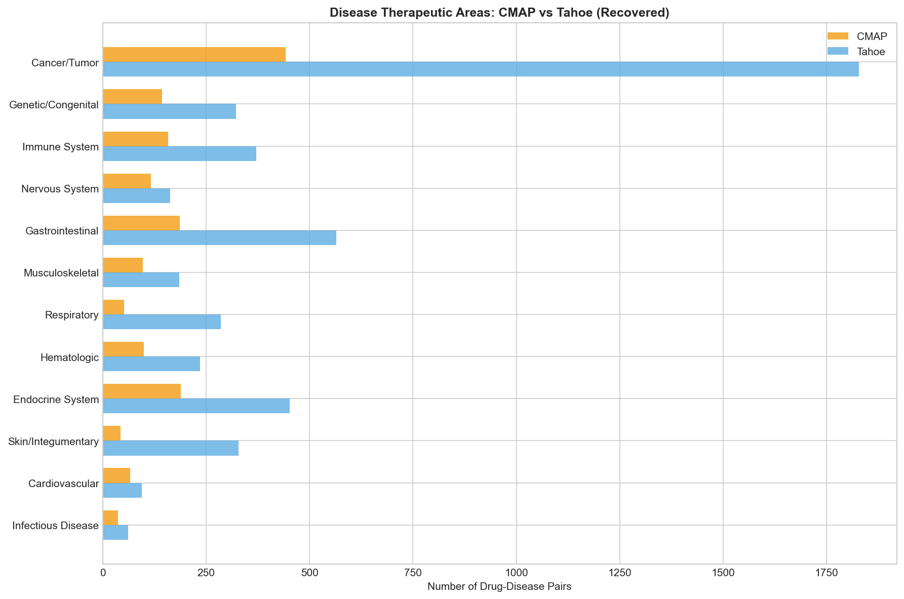

*Figure 3A. Distribution of predictions by disease therapeutic areas. Grouped bar chart comparing CMAP (orange) and TAHOE (blue) predictions across 20 therapeutic areas, showing both all discoveries (left bars) and recovered/validated predictions (right bars). Cancer/Tumor dominates both platforms, with TAHOE showing stronger enrichment in recovered predictions (28.7% vs 15.1% in all discoveries).*

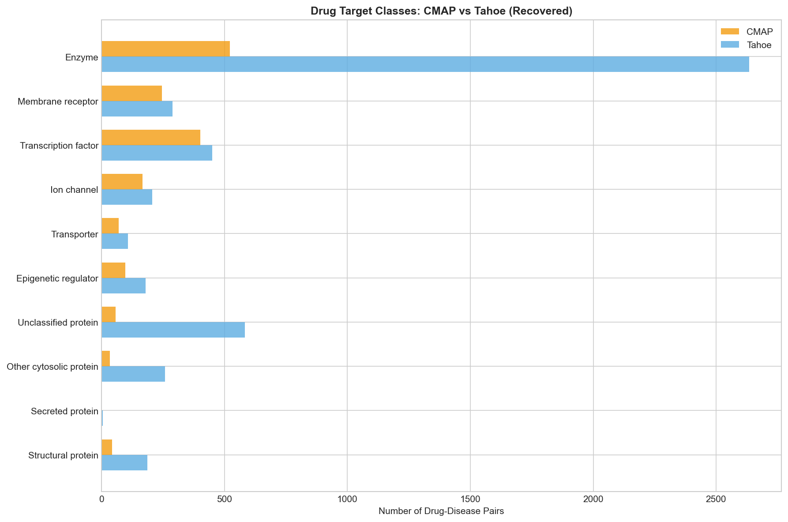

*Figure 3B. Distribution of drugs by target class. Grouped bar chart comparing CMAP (orange) and TAHOE (blue) drug target class distributions for all discoveries and recovered predictions. TAHOE displays a strongly enzyme-centric profile (44-46%) while CMAP shows a more balanced receptor-oriented distribution (35.8% membrane receptors).*

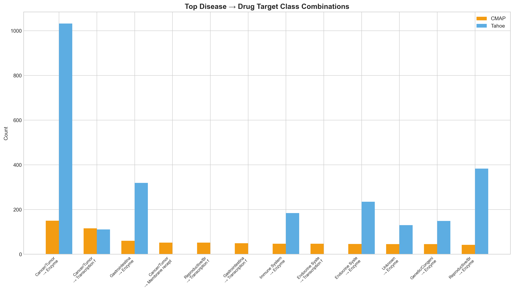

*Figure 3C. Top disease-drug class combinations. Bar chart showing the most frequent therapeutic area to drug target class mappings in recovered predictions for both platforms. The Cancer/Tumor-Enzyme combination dominates TAHOE predictions, reflecting its strength in oncology kinase inhibitors.*

## Part 4: Biological Concordance: Validated vs. Novel Predictions

To assess whether novel predictions maintain the same mechanistic profiles as clinically-validated drugs, we evaluated the biological concordance between recovered (validated) predictions and all discoveries for each platform. This analysis addresses a critical question: do the novel drug-disease predictions follow the same therapeutic logic as known relationships, or do they represent divergent explorations of chemical space?

### Concordance Metrics

We calculated multiple similarity and divergence measures between the drug target class distributions of recovered versus all discoveries for each platform:

| Metric | CMAP | TAHOE | Interpretation |
|--------|------|-------|----------------|
| **Cosine Similarity** | 0.850 | **0.987** | Higher = better concordance |
| **Pearson Correlation** | 0.800 | **0.984** | Higher = better concordance |
| **Spearman Correlation** | 0.865 | **0.889** | Higher = better concordance |
| **Jensen-Shannon Divergence** | 0.221 | **0.150** | Lower = better concordance |
| **KL Divergence** | 0.210 | **0.093** | Lower = better concordance |
| **Total Variation Distance** | 0.278 | **0.123** | Lower = better concordance |

TAHOE demonstrates excellent biological concordance (cosine similarity = 0.987), indicating that its novel predictions closely mirror the mechanistic profile of validated drugs. The low Jensen-Shannon divergence (0.150) and KL divergence (0.093) further confirm minimal distribution shift between validated and novel predictions. This suggests TAHOE's novel candidates maintain the same therapeutic logic as its clinical successes, providing confidence in their biological relevance.

CMAP shows moderate concordance (cosine similarity = 0.850), with greater divergence between validated and novel predictions. The higher Jensen-Shannon divergence (0.221) reflects CMAP's broader chemical space exploration and its receptor-to-enzyme enrichment shift between all discoveries and validated predictions. This divergence is not necessarily detrimental—it may indicate that CMAP is identifying mechanistically novel drug-disease relationships that have not yet been clinically validated.

### Comparative Heatmap Analysis

Visual comparison of the heatmaps showing drug target class versus disease therapeutic area distributions reveals consistent patterns. In the recovered predictions heatmap (Figure 4A), both platforms show expected therapeutic associations: enzyme inhibitors concentrate in oncology indications, while receptor modulators distribute across neurological and psychiatric conditions. The all discoveries heatmap (Figure 4B) shows these patterns are maintained, with TAHOE preserving its enzyme-oncology associations and CMAP maintaining its receptor-neurological patterns. The similarity between these heatmaps, particularly for TAHOE, validates that the biological logic learned from known drug-disease relationships generalizes to novel predictions.

#### Part 4 Visualization

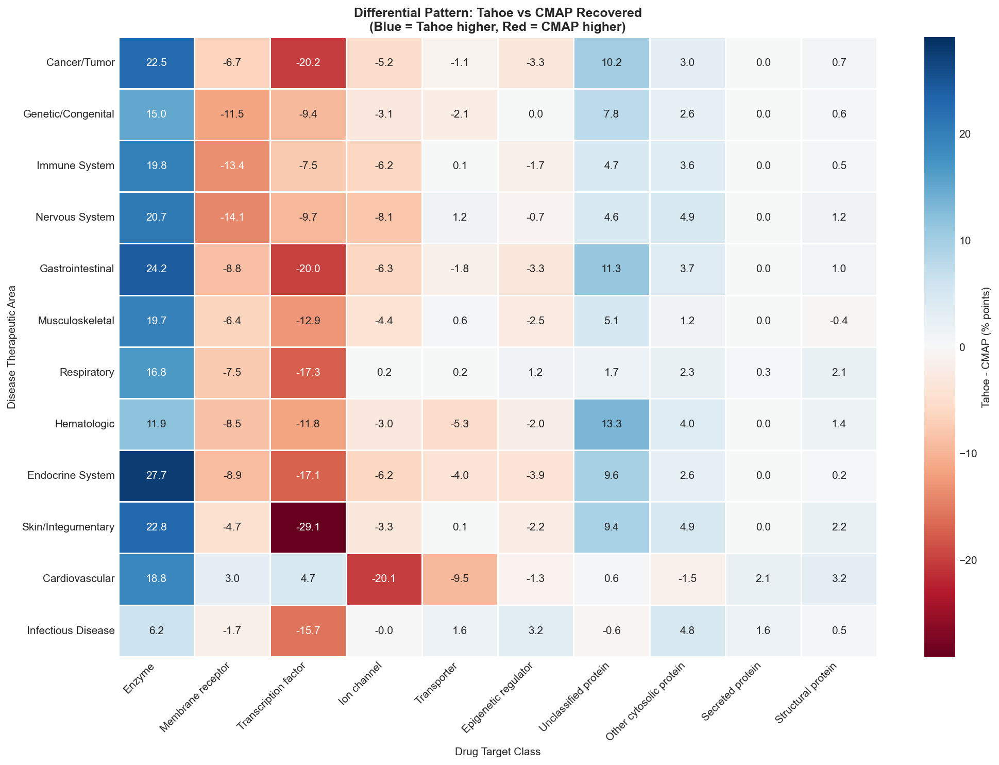

*Figure 4A. Heatmap of drug target class by disease therapeutic area for recovered (validated) predictions. Side-by-side comparison of TAHOE (left) and CMAP (right) showing the distribution of validated drug-disease pairs across drug target classes (rows) and disease therapeutic areas (columns). Color intensity represents relative frequency. Note the strong concentration of enzyme inhibitors in Cancer/Tumor for TAHOE, reflecting its kinase-centric profile.*

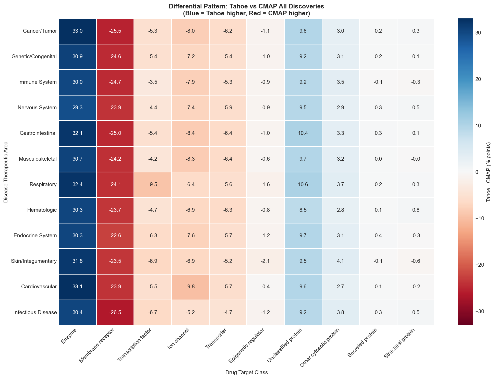

*Figure 4B. Heatmap of drug target class by disease therapeutic area for all discoveries. Side-by-side comparison showing the distribution patterns for all predicted drug-disease pairs before validation filtering. The preservation of similar patterns between this figure and Figure 4A indicates biological concordance—particularly strong for TAHOE (cosine similarity = 0.987).*

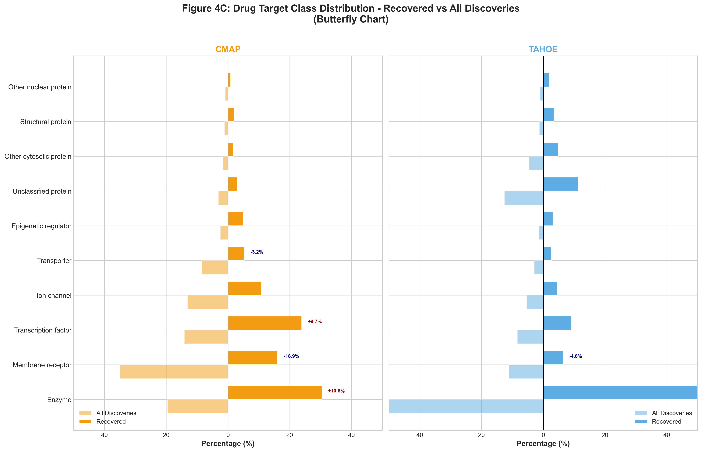

*Figure 4C. Butterfly chart comparing drug target class distributions between all discoveries (left-extending bars, lighter shade) and recovered predictions (right-extending bars, darker shade) for CMAP (left panel, orange) and TAHOE (right panel, blue). Percentage values extend from center (0%) outward in both directions. Annotations indicate significant shifts (>3%) between recovered and all discoveries. TAHOE shows minimal shifts across all categories (max 4.8%), while CMAP shows notable enrichment of transcription factors (+10.1%) in recovered predictions, indicating these targets have higher validation rates in Open Targets.*

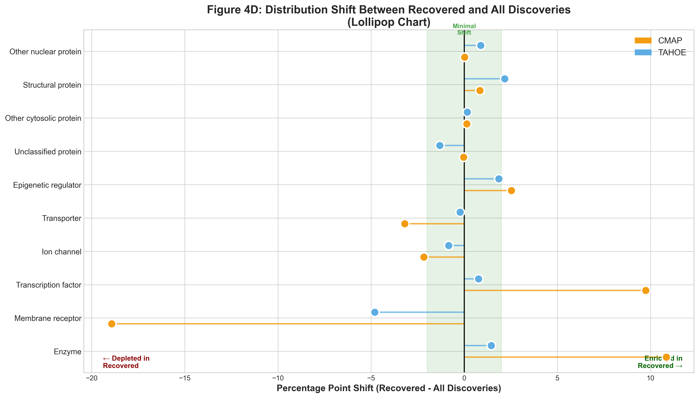

*Figure 4D. Lollipop chart showing the percentage point shift between recovered and all discoveries for each drug target class. Each lollipop represents the magnitude and direction of enrichment (positive = enriched in recovered) or depletion (negative = depleted in recovered). CMAP (orange circles) shows larger shifts than TAHOE (blue circles), with transcription factors showing the largest enrichment (+10.1%) and membrane receptors showing the largest depletion (-9.0%) in CMAP recovered predictions. The green zone indicates minimal shift (±2%), where TAHOE clusters tightly demonstrating excellent concordance.*

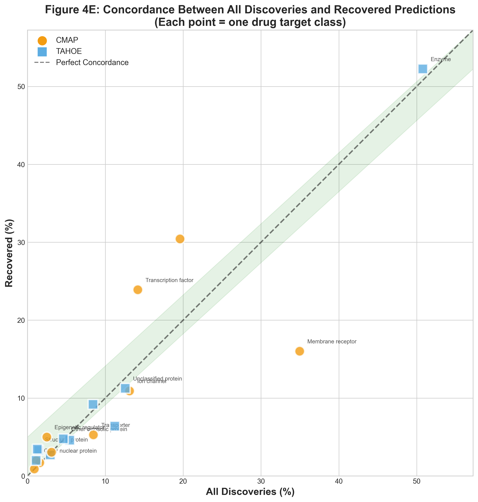

*Figure 4E. Concordance scatter plot showing the relationship between all discoveries (x-axis) and recovered predictions (y-axis) for each drug target class. CMAP (orange circles) and TAHOE (blue squares) are plotted separately. The dashed diagonal represents perfect concordance. TAHOE points cluster tightly along the diagonal (Pearson r=0.991, cosine similarity=0.994), indicating that recovered predictions maintain nearly identical mechanistic profiles to all discoveries. CMAP shows greater deviation from the diagonal (Pearson r=0.711, cosine similarity=0.853), particularly for transcription factors and membrane receptors, reflecting its broader chemical space exploration.* 

## Part 5: Case Study: Autoimmune Diseases

To evaluate pipeline performance, we analyzed 20 autoimmune diseases mapped to Open Targets via exact name or synonym matching. Autoimmune diseases constitute a rigorous, biologically grounded benchmark for transcriptional drug repurposing, as their pathogenesis is driven by aberrant immune activation that manifests as reproducible gene expression signatures [22]. Despite clinical heterogeneity, these disorders converge on shared inflammatory axes, including interferon signaling, cytokine-mediated activation, and T-cell dysregulation, allowing for a systematic evaluation of the pipeline’s ability to recover established immunomodulators [23]. Furthermore, the persistence of treatment resistance in autoimmune conditions underscores the clinical urgency for scalable approaches that nominate candidates based on molecular reversal rather than phenotype alone. In this evaluation, Tahoe-100M significantly outperformed CMAP in recovering known therapeutics (mean recovery rate: 76.6% vs. 17.8%; Wilcoxon signed-rank test p < 0.001; Cohen's d = 2.35), representing a 4.3-fold improvement.
Tahoe-100M achieved complete recovery (100%) of all available known drugs in 9 of 20 diseases (45%), including Sjögren's syndrome, autoimmune thrombocytopenic purpura, and psoriatic arthritis, whereas CMAP achieved 0% recovery in several of these conditions. Disease-specific analysis revealed Tahoe-100M's particular strength in inflammatory conditions: Crohn's disease (75.0% vs 7.4%), psoriasis (93.3% vs 4.2%), and rheumatoid arthritis (64.0% vs 17.8%). However, CMAP demonstrated better performance for type 1 diabetes mellitus and arthritis, suggesting that disease-specific biological mechanisms may favor different computational approaches.
Despite Tahoe-100M's overall superiority, the two methods showed high complementarity with only 3.5% overlap in recovered drugs. Tahoe-100M uniquely recovered 110 drugs (64.7%), while CMAP uniquely identified 54 drugs (31.8%) that Tahoe-100M missed. Drugs predicted by both methods showed 2.6-fold higher precision (5.2%) compared to single-method predictions (1.8–2.0%), suggesting consensus predictions represent higher-confidence repurposing candidates.
We then choose six representative autoimmune diseases (Sjögren's syndrome, Crohn's disease, multiple sclerosis, rheumatoid arthritis, type 1 diabetes mellitus, and systemic lupus erythematosus) to perform drug-level analysis. And this confirmed that only 7.6% of recovered drugs were identified by both platforms. Consensus drugs included cornerstone rheumatoid arthritis therapies (methotrexate, celecoxib, naproxen, dexamethasone, all Phase 4 approved), verapamil for type 1 diabetes (notable given recent clinical evidence for beta-cell preservation), and dexamethasone for multiple sclerosis and systemic lupus erythematosus.
Platform-specific patterns emerged: CMAP excelled at recovering established medications,  including NSAIDs, corticosteroids, and traditional immunosuppressants, while Tahoe-100M uniquely identified emerging targeted therapies including JAK inhibitors (tofacitinib, filgotinib) across four diseases, BTK inhibitors (tirabrutinib), and SGLT2 inhibitors for diabetes. These findings support a multi-platform approach to maximize drug discovery, as each method captures distinct therapeutic signals.

#### Figure 5: Autoimmune Disease Case Study - Platform Comparison and Drug Recovery

*Figure 5A. Scatter plot of total drug hits versus known drug recovery rate across 20 autoimmune diseases. Each point represents one disease, with CMAP (orange) and TAHOE (blue) plotted separately. Dashed lines indicate linear trend for each platform. TAHOE achieves higher recovery rates across the range of drug hits, with several diseases reaching 100% recovery. The positive correlation between hits and recovery is stronger for TAHOE, indicating more efficient target identification. CMAP shows greater variability with lower overall recovery despite generating comparable numbers of predictions for some diseases.*

*Figure 5B. Statistical comparison of known drug recovery rates between CMAP and TAHOE across 20 autoimmune diseases. Box plots show median (horizontal line), interquartile range (box), and full range (whiskers) of recovery rates. TAHOE demonstrates significantly higher recovery (mean 76.6% ± 28.4%) compared to CMAP (mean 17.8% ± 18.2%; Wilcoxon signed-rank test p < 0.001, Cohen's d = 2.35). The 4.3-fold improvement represents a large effect size, with TAHOE achieving >50% recovery in 16 of 20 diseases compared to only 2 for CMAP.*

*Figure 5C. Heatmap of drug recovery by platform across 20 autoimmune diseases. Rows represent diseases ordered by TAHOE recovery rate (top: highest), columns represent individual recovered drugs. Colors indicate recovery source: TAHOE only (blue), CMAP only (orange), both platforms (purple), and not recovered (white/gray). TAHOE achieved 100% recovery in 9 diseases including Sjögren's syndrome, psoriatic arthritis, and autoimmune thrombocytopenic purpura. The limited purple overlap (3.5% of drugs) highlights platform complementarity, with consensus drugs including methotrexate, celecoxib, dexamethasone, and verapamil representing high-confidence repurposing candidates. CMAP uniquely recovered 54 drugs (31.8%) including traditional immunosuppressants, while TAHOE uniquely identified 110 drugs (64.7%) including emerging targeted therapies (JAK inhibitors, BTK inhibitors).*

## Part 6: Conclusion

### Practical Recommendations for Platform Selection

Based on our comprehensive analysis, we provide evidence-based recommendations for researchers seeking to leverage transcriptomic drug repurposing platforms. TAHOE is recommended for programs targeting enzyme-driven pathways, particularly oncology applications involving kinase inhibitors, as well as inflammatory conditions and metabolic disorders. Its higher precision and excellent biological concordance make it ideal for programs with limited validation resources seeking to prioritize high-confidence candidates. TAHOE performs best when disease signatures are well-characterized with coherent pathway-level transcriptomic changes.

CMAP is recommended for programs exploring receptor-mediated pathways, including neurological, cardiovascular, and psychiatric indications. Its strength in identifying ion channel and transporter targets makes it valuable for these therapeutic areas. CMAP is particularly suited for exploratory programs seeking to discover novel therapeutic modalities and for diseases with poorly characterized mechanisms where broader target class coverage is beneficial. The platform's greater chemical diversity also makes it useful for identifying mechanistically distinct drug candidates.

Integration of both platforms is strongly recommended for comprehensive drug discovery campaigns. The remarkably low overlap (1.2%) in predictions demonstrates that combining outputs substantially expands therapeutic coverage without redundancy. The 144 drug-disease pairs identified by both platforms represent high-confidence predictions where multiple transcriptomic approaches converge, making them suitable for prioritized experimental validation. A tiered validation strategy could prioritize dual-platform hits, followed by platform-specific predictions based on the therapeutic area and target class alignment with each platform's strengths.

### Limitations

Several limitations should be considered when interpreting these results. A significant portion of pipeline-discovered drugs could not be matched to Open Targets annotations, with CMAP exhibiting a higher unmatched rate (49.3%) compared to TAHOE (37.0%), reflecting CMAP's inclusion of proprietary Broad Institute compounds and research chemicals not represented in public databases. Open Targets preferentially documents approved drugs and late-stage candidates, potentially underestimating the value of novel drug-disease predictions targeting less-studied mechanisms. Both platforms analyzed disease signatures from CREEDS, which may not comprehensively represent all disease states or patient populations. Finally, the fundamental methodological differences between platforms—microarray versus single-cell, perturbation signatures versus disease signatures—introduce systematic biases that favor different target classes and therapeutic areas.

Despite these limitations, our analysis demonstrates that both platforms generate biologically coherent predictions with substantial recovery of known drug-disease relationships. TAHOE shows superior precision and biological concordance, while CMAP offers complementary coverage of chemical and target space. Together, they provide a powerful toolkit for computational drug repurposing, with platform selection guided by the specific therapeutic area, target class, and program objectives.
