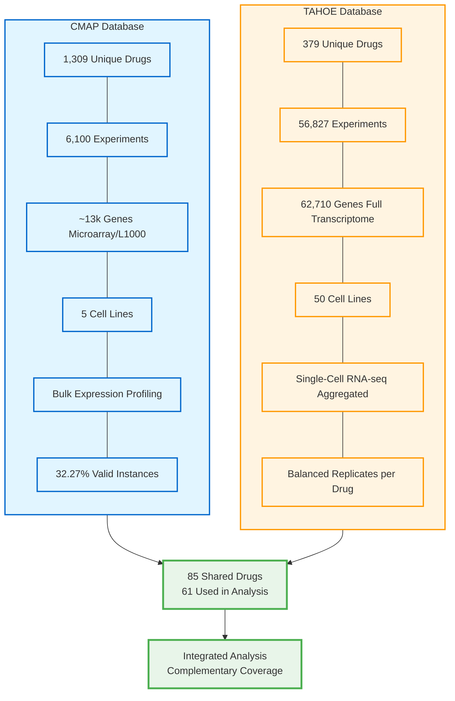
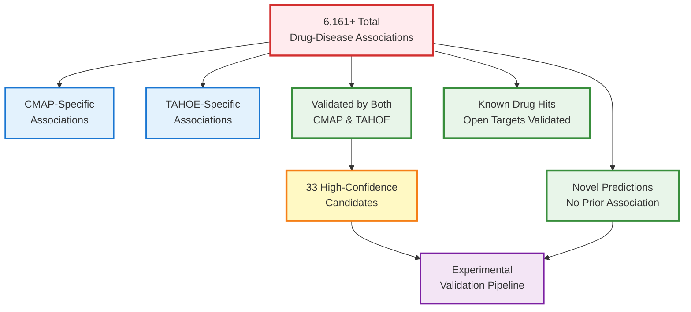

# TAHOE-CMAP Drug Repurposing Analysis Flowchart

## Manuscript-Ready Flowchart (Mermaid Format)

```mermaid
flowchart TD
    %% Data Sources
    A1[CMAP Database<br/>6,100 experiments<br/>1,309 drugs<br/>~13k genes]
    A2[TAHOE Database<br/>56,827 experiments<br/>379 drugs<br/>62,710 genes]
    A3[CREEDS Database<br/>233 Disease Signatures<br/>Manually Curated]
    
    %% Data Preprocessing
    B1[CMAP Preprocessing<br/>• Leave-one-out validation<br/>• Pearson correlation r > 0, p < 0.05<br/>• Valid instances: 32.27%<br/>• Pre-ranked signatures]
    B2[TAHOE Preprocessing<br/>• Filter significant logFC<br/>• Rank signatures<br/>• Match CMAP format<br/>• Full transcriptome]
    B3[Disease Standardization<br/>• QC1 filter applied<br/>• Mean/median consistency<br/>• |median_logFC| ≥ 0.02<br/>• UP/DOWN gene sets]
    
    %% Integration
    C1[CMAP Processed<br/>1,309 drugs<br/>Averaged experiments<br/>Rank matrix]
    C2[TAHOE Processed<br/>379 drugs<br/>Averaged experiments<br/>Rank matrix]
    C3[Disease Signatures<br/>233 diseases<br/>QC1-filtered genes<br/>Standardized]
    
    %% Shared Drugs
    D1[Shared Drug Set<br/>85 common drugs<br/>61 used in analysis]
    
    %% DRpipe Analysis
    E1[DRpipe Analysis - CMAP<br/>• Reverse scoring: TRUE<br/>• Q-threshold: 0.5<br/>• P-value filter: None<br/>• 233 diseases × 1,309 drugs]
    E2[DRpipe Analysis - TAHOE<br/>• Reverse scoring: TRUE<br/>• Q-threshold: 0.5<br/>• P-value filter: None<br/>• 233 diseases × 379 drugs]
    
    %% Results
    F1[CMAP Results<br/>Drug-disease associations<br/>Q-value rankings<br/>Score distributions]
    F2[TAHOE Results<br/>Drug-disease associations<br/>Q-value rankings<br/>Score distributions]
    
    %% Comparative Analysis
    G1[Comparative Analysis<br/>• Method consistency<br/>• Q-threshold sensitivity 0.05, 0.1, 0.5<br/>• Overlap analysis]
    
    %% Validation
    H1[Open Targets Platform<br/>Known drug validation<br/>External evidence]
    
    %% Final Results
    I1[Compiled Results<br/>6,161+ drug-disease associations<br/>33 high-confidence candidates<br/>validated by both methods]
    
    %% Additional Analysis
    J1[Novel Predictions<br/>New therapeutic candidates<br/>for experimental validation]
    J2[Known Drug Hits<br/>Literature-validated<br/>associations]
    
    %% Flow connections
    A1 --> B1
    A2 --> B2
    A3 --> B3
    
    B1 --> C1
    B2 --> C2
    B3 --> C3
    
    C1 --> D1
    C2 --> D1
    
    C1 --> E1
    C2 --> E2
    C3 --> E1
    C3 --> E2
    
    E1 --> F1
    E2 --> F2
    
    F1 --> G1
    F2 --> G1
    
    G1 --> H1
    H1 --> I1
    
    I1 --> J1
    I1 --> J2
    
    %% Styling
    classDef database fill:#e1f5ff,stroke:#0066cc,stroke-width:2px
    classDef preprocessing fill:#fff4e1,stroke:#ff9800,stroke-width:2px
    classDef processed fill:#e8f5e9,stroke:#4caf50,stroke-width:2px
    classDef analysis fill:#f3e5f5,stroke:#9c27b0,stroke-width:2px
    classDef results fill:#fce4ec,stroke:#e91e63,stroke-width:2px
    classDef final fill:#ffebee,stroke:#d32f2f,stroke-width:3px
    
    class A1,A2,A3 database
    class B1,B2,B3 preprocessing
    class C1,C2,C3,D1 processed
    class E1,E2 analysis
    class F1,F2,G1 results
    class H1 preprocessing
    class I1 final
    class J1,J2 results
```

---

## Simplified Version for Presentation

```mermaid
flowchart LR
    %% Input Stage
    subgraph INPUT[" INPUT DATA "]
        A1[CMAP<br/>1,309 drugs<br/>6,100 experiments]
        A2[TAHOE<br/>379 drugs<br/>56,827 experiments]
        A3[CREEDS<br/>233 diseases]
    end
    
    %% Processing Stage
    subgraph PROCESS[" PREPROCESSING "]
        B1[Quality Control<br/>& Validation]
        B2[Standardization<br/>& Ranking]
    end
    
    %% Analysis Stage
    subgraph ANALYSIS[" DRPIPE ANALYSIS "]
        C1[Drug-Disease<br/>Scoring]
        C2[Q-value<br/>Filtering]
    end
    
    %% Results Stage
    subgraph RESULTS[" RESULTS "]
        D1[6,161+<br/>Associations]
        D2[33 High-Confidence<br/>Candidates]
    end
    
    %% Connections
    INPUT --> PROCESS
    PROCESS --> ANALYSIS
    ANALYSIS --> RESULTS
    
    %% Styling
    classDef inputStyle fill:#e1f5ff,stroke:#0066cc,stroke-width:2px
    classDef processStyle fill:#fff4e1,stroke:#ff9800,stroke-width:2px
    classDef analysisStyle fill:#f3e5f5,stroke:#9c27b0,stroke-width:2px
    classDef resultStyle fill:#ffebee,stroke:#d32f2f,stroke-width:3px
    
    class A1,A2,A3 inputStyle
    class B1,B2 processStyle
    class C1,C2 analysisStyle
    class D1,D2 resultStyle
```



---

## Vertical Workflow Diagram

```mermaid
flowchart TD
    Start([START: Drug Repurposing Analysis])
    
    %% Step 1
    Step1[STEP 1: Data Collection<br/>━━━━━━━━━━━━━━━<br/>CMAP: 1,309 drugs, 6,100 experiments<br/>TAHOE: 379 drugs, 56,827 experiments<br/>CREEDS: 233 disease signatures]
    
    %% Step 2
    Step2[STEP 2: Quality Control<br/>━━━━━━━━━━━━━━━<br/>CMAP: Leave-one-out validation 32.27% valid<br/>TAHOE: Significance filtering + ranking<br/>CREEDS: QC1 mean/median consistency]
    
    %% Step 3
    Step3[STEP 3: Standardization<br/>━━━━━━━━━━━━━━━<br/>Rank all signatures uniformly<br/>Average experiments per drug<br/>Generate UP/DOWN gene sets]
    
    %% Step 4
    Step4[STEP 4: DRpipe Execution<br/>━━━━━━━━━━━━━━━<br/>Reverse scoring enabled<br/>Q-threshold: 0.5<br/>233 diseases × 1,688 unique drugs]
    
    %% Step 5
    Step5[STEP 5: Comparative Analysis<br/>━━━━━━━━━━━━━━━<br/>CMAP vs TAHOE comparison<br/>Q-value sensitivity 0.05, 0.1, 0.5<br/>Shared drug analysis 61 compounds]
    
    %% Step 6
    Step6[STEP 6: Validation<br/>━━━━━━━━━━━━━━━<br/>Open Targets Platform integration<br/>Known vs novel drug classification<br/>Evidence scoring]
    
    %% Final Results
    Final([RESULTS<br/>━━━━━━━━━━━━━━━<br/>6,161+ Drug-Disease Associations<br/>33 High-Confidence Candidates<br/>Both CMAP & TAHOE validated])
    
    %% Connections
    Start --> Step1
    Step1 --> Step2
    Step2 --> Step3
    Step3 --> Step4
    Step4 --> Step5
    Step5 --> Step6
    Step6 --> Final
    
    %% Styling
    classDef startEnd fill:#4caf50,stroke:#2e7d32,stroke-width:3px,color:#fff
    classDef step fill:#e3f2fd,stroke:#1976d2,stroke-width:2px
    classDef analysis fill:#f3e5f5,stroke:#7b1fa2,stroke-width:2px
    classDef validation fill:#fff3e0,stroke:#f57c00,stroke-width:2px
    
    class Start,Final startEnd
    class Step1,Step2,Step3 step
    class Step4,Step5 analysis
    class Step6 validation
```



---

## Database Comparison Visual



---

## Results Breakdown Diagram



---

## Instructions for Use in Manuscript

### Option 1: Mermaid Live Editor
1. Go to https://mermaid.live/
2. Copy any of the flowchart code blocks above
3. Paste into the editor
4. Export as PNG/SVG for your manuscript

### Option 2: Convert to Other Formats
Use tools like:
- **diagrams.net (draw.io)** - Import Mermaid or recreate
- **Lucidchart** - Professional diagram creation
- **Microsoft Visio** - Enterprise diagram tool
- **Adobe Illustrator** - For publication-quality graphics

### Option 3: Include in Markdown/Quarto/R Markdown
If your manuscript is in Markdown/Quarto/R Markdown format, you can include the Mermaid code directly:

\`\`\`{mermaid}
[paste flowchart code here]
\`\`\`

### Recommended for Manuscript
The **"Vertical Workflow Diagram"** is most suitable for manuscript figures as it:
- Shows clear step-by-step progression
- Includes key metrics at each stage
- Is easy to read in 2-column journal format
- Highlights main findings

The **"Detailed Flowchart"** is better for:
- Supplementary materials
- Detailed methodology sections
- Grant applications
- Technical reports
